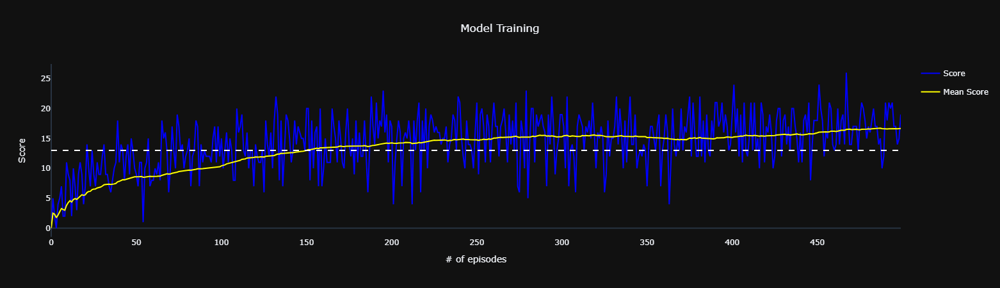

# Project 1: Navigation

## Description of the implementation

### Algorithm
In order to solve this challenge, I have explored and implemented the Double Deep Q-Network (DDQN) and Dueling DQN algorithm.

* [Deep Q-Network](https://storage.googleapis.com/deepmind-media/dqn/DQNNaturePaper.pdf)
* [Double Deep Q-Network](https://arxiv.org/abs/1509.06461)
* [Dueling Q-Network](https://arxiv.org/abs/1511.06581)


### Approach

In order to solve this challenge, I have implemented both the Double Deep Q-Network (DDQN) and Dueling DQN algorithm. Since DDQN tends to have more stable training, I have chosen it over the Deep Q-Network (DQN) algorithm. And since state values remain the same for all actions from a given state, I also wanted to explore the Dueling DQN to see if it can improve the performance of the agent.

The algorithm is implemented in the `Navigation.ipynb` notebook. The implementation is based on the [Deep Q-Network (DQN) exercise]. 

I tried multiple model architectures and hyperparameters. The final model architecture is a simple 3-layer fully connected network with 128 hidden units in each layer for both the value and advantage streams, with the first 2 layers shared between them. The final model architecture is shown below:

```
DuelingQNetwork(
  (common_network): Sequential(
    (fc0): Linear(in_features=37, out_features=128, bias=True)
    (relu0): ReLU()
    (fc1): Linear(in_features=128, out_features=128, bias=True)
    (relu1): ReLU()
  )
  (value_out): Linear(in_features=128, out_features=1, bias=True)
  (advantage_out): Linear(in_features=128, out_features=4, bias=True)
)

```

The final hyperparameters are:

```
  buffer_size=int(1e5)
  batch_size=64
  gamma=0.99
  tau=1e-2
  lr=1e-3
  lr_decay=0.995
  update_every=4
  n_episodes=500
  eps_start=0.10
  eps_end=0.01
  eps_decay=0.99
```

This model was able to solve the environment in 196 episodes, as you can see in the training progress chart below:



> The dashed line represents the target score of 13.0

### Future Work

I would like to explore the following ideas in the future:
1. Although I have spent a great deal of time tailoring the hyperparameters, there may be other sets of values that conduce the Agent to solve the environment even faster. Thus, more tests might be performed to verify that.
2. Implementing the Prioritized Experience Replay.
3. Trying a few other variants of the DQN algorithm.
